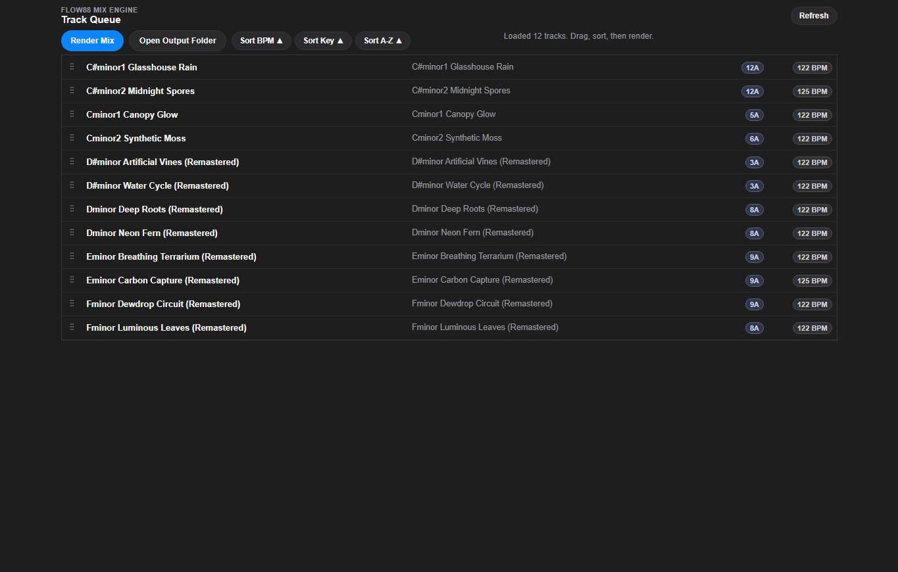
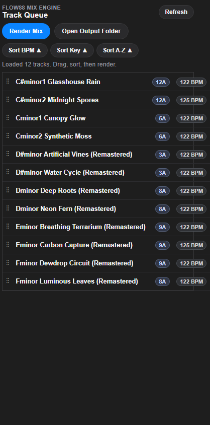

# Flow88 Mix Engine

Flow88 Mix Engine is a Python audio/video mastering app that now supports both local use and headless server deployment.

- Audio: analyze BPM/key, reorder tracks, and render a continuous mixed WAV.
- Video: queue clips, set loop counts, configure transitions, preflight, and render final/preview video.
- Deployment: run the existing browser UI through FastAPI locally or as a remote DGX Spark render node.

## Screenshots

### Desktop Queue



### Mobile/Narrow Layout



## Features

- Analyze audio in the configured input directory (`.mp3`, `.wav`, `.flac`, `.m4a`, `.aac`, `.ogg`)
- Extract precise duration with `ffprobe`
- Detect BPM, musical key, and Camelot harmonic key
- Drag/drop sorting for audio and video queues
- Audio mix rendering with FFmpeg `acrossfade` + `loudnorm`
- Video rendering from the configured video input directory with configurable transitions
- Preview renders, render preflight checks, and background job polling
- FastAPI-served frontend at `/`
- `/health` and `/diagnostics` endpoints for deployment checks
- Explicit FFmpeg/NVENC diagnostics with CPU fallback
- Browser-based file management for input, video input, output, and project files

## Requirements

- Python 3.11+
- FFmpeg and FFprobe available in `PATH`
- Web/server mode: Windows, macOS, or Linux
- Desktop wrapper: optional and installed separately via `requirements/desktop.txt`

## Quick Start

1. Create and activate a virtual environment.

```bash
python -m venv .venv
source .venv/bin/activate
```

Windows PowerShell:

```powershell
.\.venv\Scripts\Activate.ps1
```

2. Install server dependencies.

```bash
pip install -r requirements.txt
```

3. Put source files in the default directories:

- Audio: `input/`
- Video: `input/videos/`

4. Start the FastAPI app.

```bash
python server.py
```

Then open `http://127.0.0.1:8000`.

Optional desktop wrapper:

```bash
pip install -r requirements/desktop.txt
python desktop_app.py
```

Windows helper script:

```bat
runMixer.bat
```

## Runtime Configuration

These environment variables keep local and Docker usage aligned:

- `FLOW88_INPUT_DIR`
- `FLOW88_OUTPUT_DIR`
- `FLOW88_PROJECTS_DIR`
- `FLOW88_LOGS_DIR`
- `FLOW88_CORS_ORIGINS`
- `FLOW88_HOST`
- `FLOW88_PORT`
- `FLOW88_MAX_UPLOAD_SIZE_BYTES`

Defaults remain local-friendly:

- Input: `./input`
- Video input: `./input/videos`
- Output: `./output`
- Logs: `./logs`
- Projects: per-user app data unless `FLOW88_PROJECTS_DIR` is set
- CORS: `*`
- Max browser upload size: `8589934592` bytes (8 GiB)

## DGX Spark Deployment

This repo can run as a headless render/analyze service on NVIDIA DGX Spark. In this mode, the DGX box hosts FastAPI + FFmpeg, and a browser on your main PC connects over the LAN. The desktop wrapper is not required.

### Build

```bash
mkdir -p docker-data/input/videos docker-data/output docker-data/projects docker-data/logs
docker compose build
```

### Run

```bash
FLOW88_CORS_ORIGINS=http://YOUR-PC-IP:8000 docker compose up -d
```

The compose stack:

- Exposes `8000`
- Installs `ffmpeg` and `ffprobe`
- Mounts persistent volumes for input, output, projects, and logs
- Requests NVIDIA GPU access
- Sets `NVIDIA_DRIVER_CAPABILITIES=compute,video,utility`
- Includes a healthcheck against `/health`

### Volume Mounts

- `./docker-data/input:/srv/flow88/input`
- `./docker-data/output:/srv/flow88/output`
- `./docker-data/projects:/srv/flow88/projects`
- `./docker-data/logs:/srv/flow88/logs`

Put audio files in `docker-data/input/` and video clips in `docker-data/input/videos/`.
You can also upload and manage these files from the browser once the service is running.

### LAN Access

Open the service from another machine at:

```text
http://DGX_SPARK_IP:8000
```

If the frontend will be served from a different origin, set `FLOW88_CORS_ORIGINS` to a comma-separated allowlist.

### Remote File Management

For DGX Spark and other headless deployments, use the browser UI instead of desktop folder-opening.

- Audio tab `Manage Input`: list, upload, rename, and delete files in the configured input directory.
- Video tab `Manage Input`: list, upload, rename, and delete files in the configured `input/videos` directory.
- `Manage Output`: list, download, rename, and delete rendered mixes, previews, logs, and final videos.
- `Manage Projects`: list, download/export, rename, and delete saved `.flowmix` project files.
- Deletes require browser confirmation, and all file operations stay restricted to the configured runtime directories.
- The older `open-*` routes remain for local desktop-style workflows, but the browser file manager is the supported DGX path.

### Shared Folder Workflow

For large audio batches, a mounted/shared folder is usually better than browser upload.

- Point `FLOW88_INPUT_DIR` at a host path backed by your preferred shared storage, then mount that same path into the container.
- Common options are SMB/CIFS, NFS, Synology/QNAP shares, or a host-managed sync folder that lands inside `docker-data/input/`.
- Copy large `.wav`, `.flac`, or `.mp3` files into that shared folder from your main PC, then use `Refresh` in the Audio Mix tab to rescan the active input directory.
- Browser upload is still useful for quick tests and one-off assets, but shared folders are the preferred DGX workflow for bigger libraries.

### Troubleshooting

- `GET /health` confirms the service is up.
- `GET /diagnostics` shows configured directories, ffmpeg/ffprobe paths, encoders, hwaccels, and the preferred H.264 encoder.
- If a file shows up in `Manage Input` but not in the Audio Mix table, refresh the library and check whether the file is marked unsupported or whether the Audio Mix status reports an analysis rejection.
- If renders fall back to CPU, check whether `/diagnostics` shows both `h264_nvenc` and `cuda`.
- If NVENC is missing in Docker, verify the host has NVIDIA Container Runtime enabled and that `NVIDIA_DRIVER_CAPABILITIES` includes `video`.
- Inspect container logs with `docker compose logs --tail 100 flow88`.

## How Audio Rendering Works

1. `analyzer.py` discovers files and extracts tags.
2. `ffprobe` extracts source duration for each track.
3. `librosa` estimates BPM and key.
4. `mixer.py` computes timeline starts and total length.
5. `mixer.py` builds the audio filter graph.
6. Tracks are chained with `acrossfade`.
7. `loudnorm` is applied.
8. Final WAV and tracklist are written to the configured output directory.

## How Video Rendering Works

1. Video items are normalized from queue order and loop counts.
2. Scene sequence is expanded to match audio duration.
3. A concat timeline file is generated.
4. A dynamic transition graph is built with `xfade`.
5. Render runs in chunks to keep memory usage bounded.
6. Chunks are stitched, then audio is muxed once.
7. Encoder selection is logged as either `h264_nvenc` or CPU `libx264`.

## API Endpoints

- `GET /` serves `frontend/index.html`
- `GET /health` returns service health and encoder summary
- `GET /diagnostics` returns startup/runtime diagnostics
- `GET /tracks` returns analyzed tracks
- `POST /mix` renders the audio mix
- `GET /videos` returns analyzed videos
- `POST /render-preflight` validates video render inputs and transition graph
- `POST /generate-video` queues final video render
- `POST /generate-preview` queues preview render
- `GET /video-jobs/{job_id}` polls video render progress
- `GET /video-render-profiles` lists render profiles
- `GET /projects` lists saved projects
- `POST /project/save` saves a project
- `POST /project/load` loads a project
- `GET /project/autosave` returns autosave state
- `GET /api/files/input`, `POST /api/files/input/upload`, `DELETE /api/files/input/{filename}`, `POST /api/files/input/rename`
- `GET /api/files/input/videos`, `POST /api/files/input/videos/upload`, `DELETE /api/files/input/videos/{filename}`, `POST /api/files/input/videos/rename`
- `GET /api/files/output`, `GET /api/files/output/{filename}/download`, `DELETE /api/files/output/{filename}`, `POST /api/files/output/rename`
- `GET /api/files/projects`, `GET /api/files/projects/{filename}/download`, `DELETE /api/files/projects/{filename}`, `POST /api/files/projects/rename`
- `GET /open-output`, `GET /open-audio-source`, `GET /open-video-source` remain available for local desktop-style workflows, but the browser file manager is the preferred remote path

## Migration Notes

- `requirements.txt` now installs the server path only. Desktop extras live in `requirements/desktop.txt`.
- The primary mixed-audio output is now `output/final_mix.wav`. Existing `flow88_master_mix.wav` files are still accepted as render input fallback.
- Runtime directories and CORS can now be configured with environment variables without changing code.
- Remote browser file management now replaces the old folder-opening workflow for headless DGX usage.
- `server.py` is the primary entrypoint for local and containerized runs.

## Project Layout

```text
frontend/
  index.html
  app.js
  styles.css
requirements/
  base.txt
  server.txt
  desktop.txt
analyzer.py
mixer.py
video_processor.py
models.py
tracklist.py
runtime_config.py
server.py
desktop_app.py
main.py
Dockerfile
docker-compose.yml
LLM_CONTEXT.md
```

## LLM Context File

Detailed implementation context for AI agents is available in [LLM_CONTEXT.md](LLM_CONTEXT.md).
